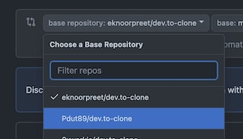
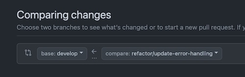

# How To Contribute

Contributions are managed by means of branches and pull requests. The process is described below.

Note that contributions are made to the `develop` branch rather than `main`.

## Workflow

### 1. Switch to the `develop` branch and pull the latest changes

```shell
git switch develop
git pull
```

### 2. Create a new feature or bugfix branch and git it a descriptive name

```shell
$ git branch feature/[feature-description]
# OR
$ git branch bugfix/[error-description]

# Examples:
$ git checkout feature/add-fallback-images
# OR 
$ git checkout bugfix/fix-tags-requests
```

### 3. Complete your work and commit your changes

```shell
# Stage the changed files for commit:
$ git add .

# Commit your changes, for example:
$ git commit -m "feature: add fallback image for user profile"
# OR
$ git commit -m "bugfix: fix tag route timeout error"
```

### 4. Push your local changes to GitHub

```shell
# First, ensure your local branch is up to date with the GitHub develop branch by pulling the latest version:

$ git pull origin develop 
# Fix merge conflicts, if any.
# Push your branch to GitHub:
$ git push

# Note: The first branch push must be in this format: 
git push --set-upstream origin [branchname]
# For example:
git push --set-upstream origin feature/add-fallback-images


## NOTE: When your change or bug fix is complete, proceed to open a pull request (Step 6). Otherwise, repeat steps 3 and 4
```

### 6. Open a Pull Request on GitHub

1. Open the [*Pull requests*](https://github.com/Pdut89/dev.to-clone/pulls) tab on GitHub.

2. Select *New pull request*.

3. Select `Pdut89/dev.to-clone` as the base repository:


4. Select to compare your feature/bugfix branch to the develop branch, for example:


5. Click "Create pull request"

6. Tag your team mates as reviewers (top-right corner)

7. Click "Create pull request" again.

8. Share the pull request link with your team members.

### 7. Wait for feedback from your team members

- If changes are requested, repeat steps 3 and 4 to update the pull request with the requested changes.

- If your pull request is approved by your team members, click 'Merge pull request'.

### Repeat steps 1 to 7 for your next contribution
